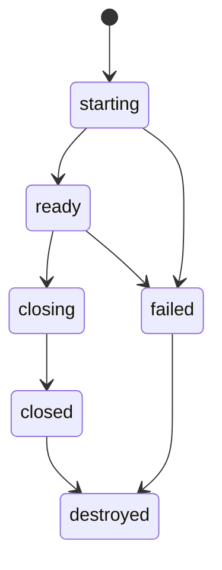
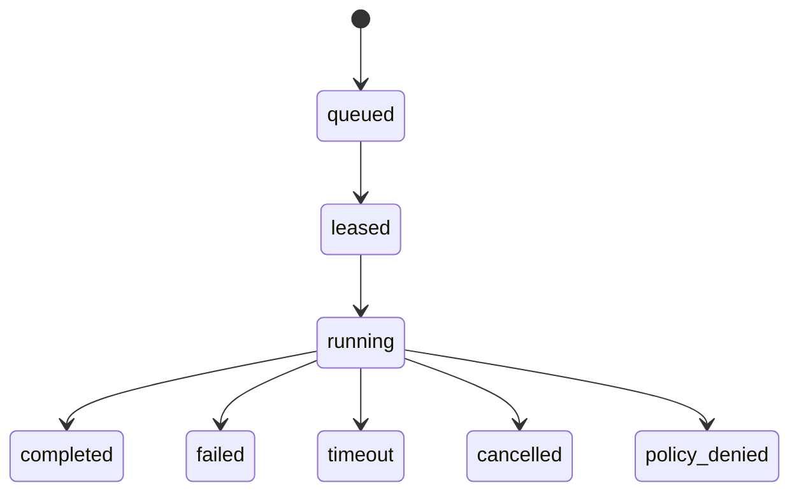

# Session Lifecycle

Sessions are the state boundary. Each invocation belongs to exactly one session.
The current implementation supports `new` and `existing` workspaces; `snapshot`
and `template` remain protocol states until the snapshot store exists.



## Workspace Modes

`new`

Create an empty workspace for this session.

`existing`

Bind an existing host directory as the session workspace.

`snapshot`

Hydrate the workspace from a previously captured snapshot.

`template`

Create the workspace from a named template.

## Logical Workspace

The host should expose a stable logical root:

```text
/workspace
```

The real host path may be different:

```text
/tmp/executioner/sessions/sess_123/workspace
/Users/example/project
/var/lib/executioner/workspaces/sess_123
```

Tools and agent-visible results should prefer logical paths. Host internals can
retain real paths for enforcement and execution.

The host rejects absolute host paths in tool arguments. Callers use relative
paths or `/workspace/...` logical paths. This avoids accidentally teaching agent
apps about host filesystem layout.

## Host API

```text
POST   /sessions
GET    /sessions/:sessionId
POST   /sessions/:sessionId/close
DELETE /sessions/:sessionId

POST   /sessions/:sessionId/invocations
GET    /sessions/:sessionId/invocations/:invocationId
GET    /sessions/:sessionId/effects
```

The HTTP server currently stores sessions in process memory and writes managed
workspaces under the host state directory. Destroying a managed session removes
its workspace. Existing workspaces are never deleted by destroy.

The SDK makes this explicit with lifecycle config:

```text
CloseBehavior::DestroySession  -> mark session destroyed; remove managed workspace
CloseBehavior::CloseSession    -> mark session closed; preserve managed workspace

QueueCleanup::Preserve         -> leave file broker directories for audit/debug
QueueCleanup::DeleteOnClose    -> remove the SDK-owned queue directory on close
```

Workspace cleanup and queue cleanup are separate. A managed `new` workspace is
owned by the host session lifecycle. A file-backed broker queue is owned by the
SDK/backend lifecycle. An `existing` workspace is caller-owned and is preserved
even when the session is destroyed.

If a session is created with `ttlMs`, the host treats it as expired after that
duration. Expired managed sessions are purged on the next host operation and
their managed workspace is removed. Existing workspaces are not removed by TTL
purge, for the same reason they are not removed by explicit destroy.

## Invocation Lifecycle



The broker-side lifecycle and host-side lifecycle can be stored separately, but
they should share the same invocation id.

The initial file-backed broker stores this lifecycle as directories:

```text
pending/
claimed/
completed/
failed/
```

`claimed` files include the worker id, attempt id, and lease token. This is not
intended to be the final production broker, but it keeps the local development
path honest about pull-worker ownership.

## Minimum Session Request

```json
{
  "workspace": {
    "mode": "new",
    "mountAsWorkspace": true
  },
  "policy": {
    "readRoots": ["/workspace"],
    "writeRoots": ["/workspace"],
    "process": {
      "allowExec": true
    },
    "network": {
      "enabled": false
    },
    "maxDurationMs": 300000,
    "maxOutputBytes": 100000
  }
}
```
